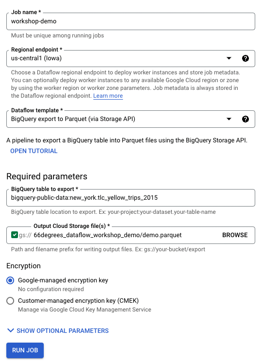
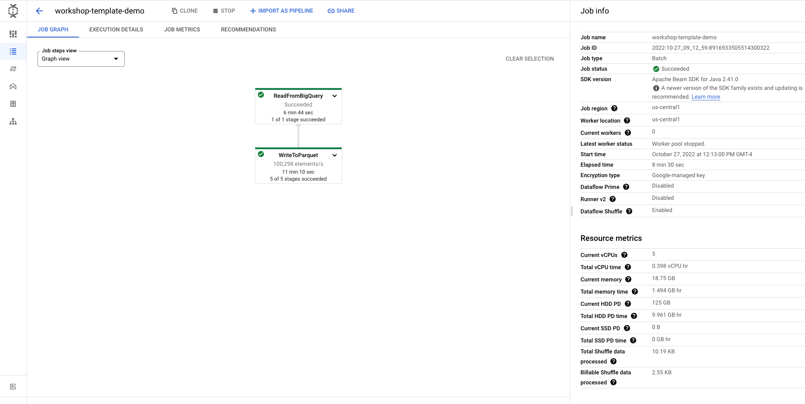

# Dataflow Template Quickstart

Walkthrough for deploying a simple Dataflow Pipeline using Google-Provided Templates

1. Open google cloud console (`https://console.cloud.google.com/`) and select the project you are working on.

2. Search Dataflow in the search box and open Dataflow and navigate to Jobs.

3. Click on CREATE to create a new job and enter the following.
    - Enter Job name (Must be unique among running jobs)
    - Select Regional endpoint (Dataflow regional endpoint to deploy worker instances and store job metadata)
    - Select Dataflow template as BigQuery export to parquet (via Storage API) - A pipeline to export a BigQuery table into Parquet files using the BigQuery Storage API.
    <!-- UPDATE THIS TO NOT USE THE PUBLIC DATASET AS IT WILL FAIL -->
    - Enter BigQuery table to export (e.g. `bigquery-public-data:new_york.tlc_yellow_trips_2015`)
    - Select Temporary location - Path and filename prefix for writing output files. (e.g. `gs://66degrees_dataflow_workshop_demo/demo.parquet`)

   

4. Click on RUN JOB.
    - After job executes a job details will become available that include a job graph that details the steps within the job and the status, as well as other job information.
    
       
