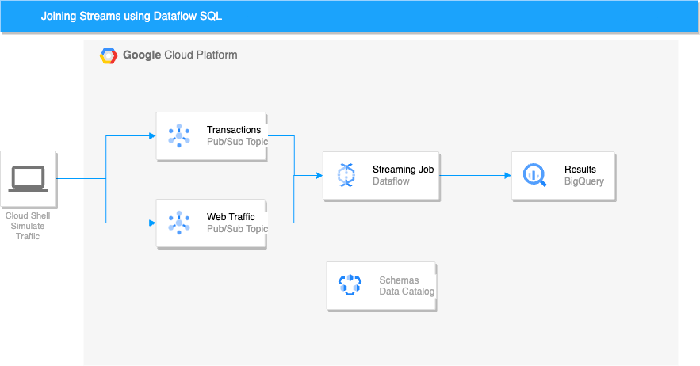
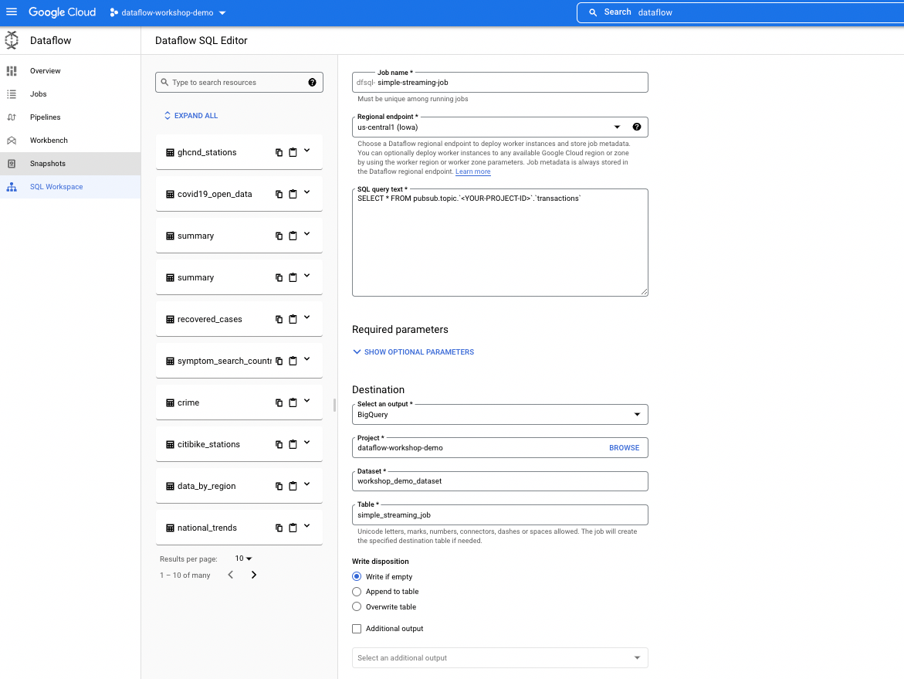
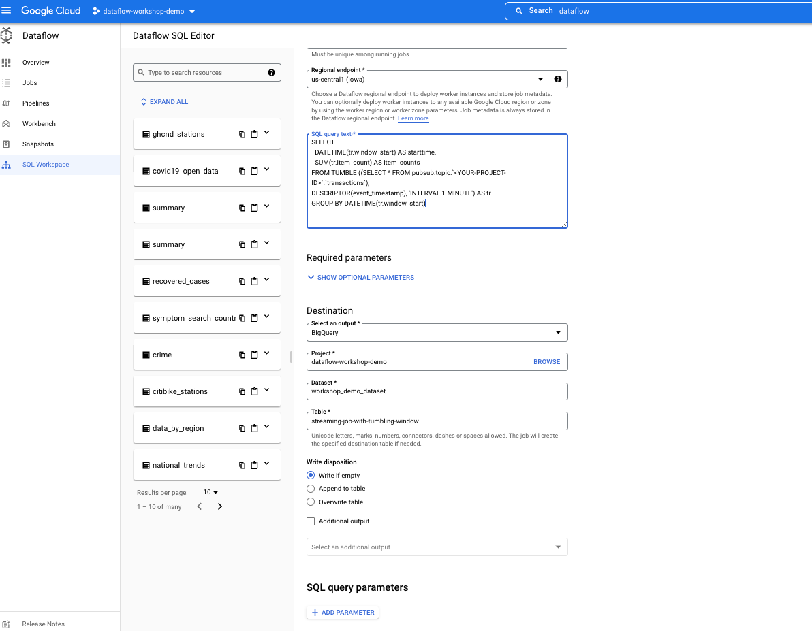
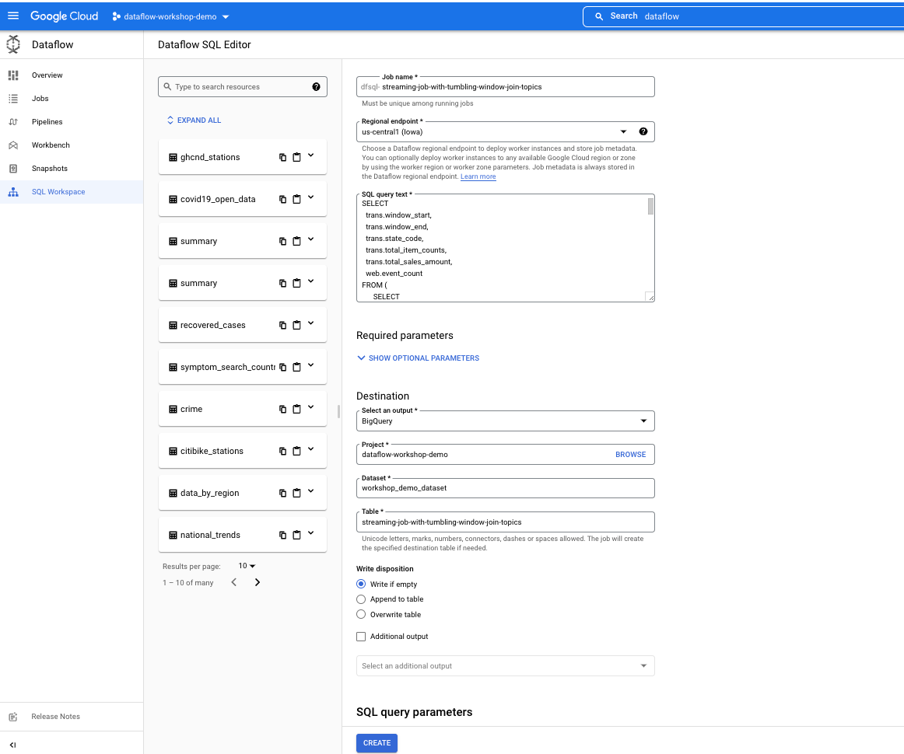

# LAB: Joining Multiple Pub/Sub Streams using Dataflow

This lab will walk through the process of authoring, deploying and running a Dataflow SQL Pipeline that joins streaming data from 2 Pub/Sub Topics in Cloud Dataflow.

### Introduction
In this lab we will use dataflow sql to stream and join two pub sub data sources in store the results in BigQuery.



The general flow of the lab includes the following stages:
1. Creating Pub Sub Topics
2. Creating the Pub Sub Schemas and storing them in Data Catalog
3. Creating the BigQuery Dataset for output results
4. Simulate Pub Sub Traffic by running the python script
5. Using Dataflow SQL workbench to create the Dataflow pipelines


### Step 1: Creating Pub Sub Topics
Start a cloud shell instance create the following topics for your project.

`gcloud pubsub topics create transactions `

`gcloud pubsub topics create web-traffic `


### Step 2: Creating the Pub Sub Schemas and storing them in Data Catalog
```bash
gcloud data-catalog entries update \
--lookup-entry='pubsub.topic.`<YOUR-PROJECT-ID>`.transactions' \
--schema-from-file=./schemas/transactions_topic_schema.yaml
```

```bash
gcloud data-catalog entries update \
--lookup-entry='pubsub.topic.`<YOUR-PROJECT-ID>`.web-traffic' \
--schema-from-file=./schemas/web_traffic_topic_schema.yaml
```

### Step 3: Create the destination BigQuery Dataset

```bash
bq --location US mk --dataset workshop_demo_dataset
```

### Step 4: Simulate Pub Sub Traffic by running the python script
In your cloud shell instance, run the following command (this will send messages to the pub sub topics).

```bash
python transactions_web-traffic-publisher.py
```

### Step 5: Run the Dataflow SQL jobs

#### Simple streaming dataflow sql job
This simple dataflow job just streams transactions pub sub messages into a BigQuery Table.


Open a Dataflow page from the console and run the following query in the sql query text. **Ensure that the project
id placeholder is replaced with your project id.** 

```sql
SELECT * FROM pubsub.topic.`<YOUR-PROJECT-ID>`.`transactions`
```

Use the same job inputs as specified below in the following images then click create to run the job. You should see the dataflow pipeline
running and see the results outputting to BigQuery


The results should look like the following:

|event_timestamp               |state_code                    |timestamp|item_count|total_sale_amount|
|------------------------------|------------------------------|---------|----------|-----------------|
|2022-11-02 15:48:43.736000 UTC|AK                            |2022-11-02 15:48:43|3         |636.75           |
|2022-11-02 15:51:41.454000 UTC|AK                            |2022-11-02 15:51:40|3         |829.57           |
|2022-11-02 15:44:55.385000 UTC|AL                            |2022-11-02 15:44:54|3         |224.84           |

#### Simple streaming dataflow sql job with TUMBLING windows
In this query we use a tumbling window with a 1-minute interval to window the results. Each minute the 
aggregates are calculated and the results are sent to BigQuery. 

Open the Dataflow page from the console and run the following query in the sql query text. **Ensure that the project
id placeholder is replaced with your project id.**

```sql
SELECT
  DATETIME(tr.window_start) AS starttime,
  SUM(tr.item_count) AS item_counts
FROM TUMBLE ((SELECT * FROM pubsub.topic.`<YOUR-PROJECT-ID>`.`transactions`),
DESCRIPTOR(event_timestamp), 'INTERVAL 1 MINUTE') AS tr
GROUP BY DATETIME(tr.window_start)
```

Use the same job inputs as specified below in the following images then click create to run the job. You should see the dataflow pipeline
running and see the results outputting to BigQuery



The results should look like the following:

|starttime          |item_counts|
|-------------------|-----------|
|2022-11-02T14:56:00|187        |
|2022-11-02T14:57:00|180        |
|2022-11-02T14:58:00|143        |


#### Multiple streams dataflow sql job with TUMBLING windows
In this query we use a tumbling window with a 1 minute interval to window on both streams and join the results on the state ID. In this case
for every minute we get the total item counts and total sales amounts for each state from the transactions topic, this is joined to the web-traffic event counts
which shows the total events for each state on the web-traffic topic. 

Open the Dataflow page from the console and run the following query in the sql query text. **Ensure that the project
id placeholder is replaced with your project id.**

```sql
SELECT
  trans.window_start,
  trans.window_end,
  trans.state_code,
  trans.total_item_counts,
  trans.total_sales_amount,
  web.event_count
FROM (
      SELECT
        tr.window_start,
        tr.window_end,
        tr.state_code,
        SUM(tr.item_count) AS total_item_counts,
        SUM(tr.total_sale_amount) AS total_sales_amount
      FROM
        TUMBLE((
          SELECT
            *
          FROM
            pubsub.topic.`<YOUR-PROJECT-ID>`.`transactions`),
          DESCRIPTOR(event_timestamp),
          "INTERVAL 5 MINUTE") AS tr
      GROUP BY
      tr.state_code,
       tr.window_start, tr.window_end
    ) trans
INNER JOIN (
  SELECT
    tr.state_code,
    tr.window_start,
    tr.window_end,
    COUNT(user_id) as event_count,
  FROM
    TUMBLE((
      SELECT
        *
      FROM
        pubsub.topic.`<YOUR-PROJECT-ID>`.`web-traffic`),
      DESCRIPTOR(event_timestamp),
      "INTERVAL 5 MINUTE") AS tr
  GROUP BY
    tr.state_code,
    tr.window_start, tr.window_end
    ) web
ON
    trans.state_code = web.state_code
```


Use the same job inputs as specified below in the following images then click create to run the job. You should see the dataflow pipeline
running and see the results outputting to BigQuery





The results should look like the following below:


|window_start                  |window_end                    |state_code|total_item_counts|total_sales_amount|event_count|
|------------------------------|------------------------------|----------|-----------------|------------------|-----------|
|2022-11-03 02:55:00.000000 UTC|2022-11-03 03:00:00.000000 UTC|SC        |268              |22262.18          |48         |
|2022-11-03 02:55:00.000000 UTC|2022-11-03 03:00:00.000000 UTC|MO        |188              |19203.65          |62         |
|2022-11-03 02:55:00.000000 UTC|2022-11-03 03:00:00.000000 UTC|IN        |316              |27257.59          |54         |
|2022-11-03 02:50:00.000000 UTC|2022-11-03 02:55:00.000000 UTC|IN        |402              |33937.66          |48         |
|2022-11-03 02:50:00.000000 UTC|2022-11-03 02:55:00.000000 UTC|MO        |423              |39304.67          |47         |
|2022-11-03 02:50:00.000000 UTC|2022-11-03 02:55:00.000000 UTC|SC        |373              |30760.3           |49         |
